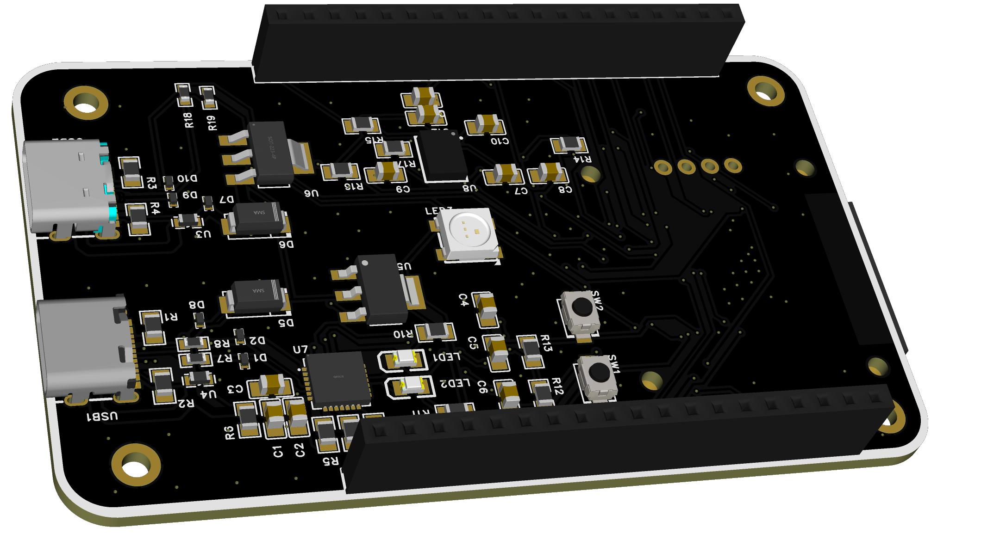
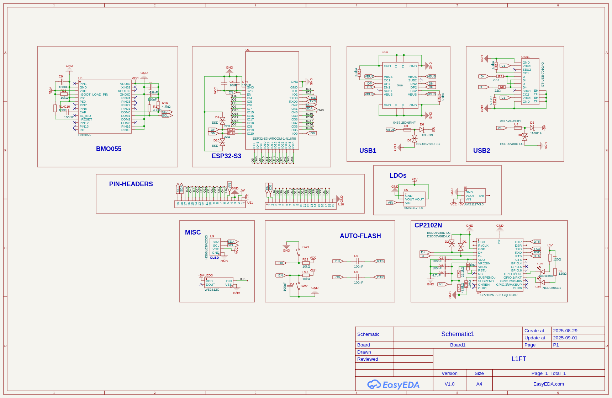

# L1FT
 
A unique and wierd authentication system which allows users only if a certain kind of motion 
is performed with a physical device like lifting it up and down certain times.

## Features :
- Wierd and unique
- No online access
- Misguiding and unpredictable
- Physical device dependancy

## Demo :
**With Physical Hardware**

**On Simulation**

## Usage :
---
### Method 1 : With Physical Hardware
---
##### **Requirements**
- ESP32/ESP8266
- MPU6050
- Oled (optional)

#### **Circuit :** 


#### Code :
[Code](Code/)  

Copy the code and paste in arduino ide and change the wifi credentails and then flash it.  
After that visit to : <ESP_IP>:80 
  
In the User and Password write anything it is just a distraction,to get access you need to have atleast 7 reps then you can enter with any credentails. 

Demo: 

---
### Method 2 : With Simulated Hardware
---  
#### **Requirements**
- VS CODE
- Platform IO
- Wokwi Simulator 

#### VS Code Setup :
In VS code download [Platform IO](https://platformio.org/install/ide?install=vscode) and [Wokwi Simulator](https://docs.wokwi.com/vscode/getting-started)
After that you are good to go.  
Video Guide :


#### Usage :
**Clone this repo**
```bash
gh repo clone Sameer-Kulhari/L1FT
```
- **Click on Build in Bottom Panel**  
- **Go to Diagram.json and click on run**
- **Go to localhost:8180 and use it**

Video Guide :


---
### Method 3 : Motion detection only on simulated hardware
---
Go to [Wokwi Web](https://wokwi.com/projects/440840273941131265)  
Click on Start and wait for few seconds then click on the Sensor and move the **Z-Axis** parameter few times you can see the reps counter in display.

## Custom Device :
For more relability and ease of access you can look on pcb design for custom hardware with more advance features like **High precesion** sensors with **Sensor-Fusion** and **Higher performance** 

### Images :
#### **PCB 3D Images :**
<p>
     
     
</p>

#### **Schematic :**



