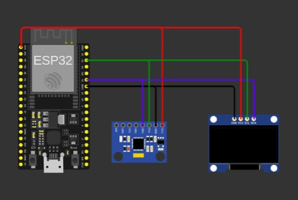

# L1FT
 
A unique and wierd authentication system which allows users only if a certain kind of motion 
is performed with a physical device like lifting it up and down certain times.

## Features :
- Wierd and unique
- No online access
- Misguiding and unpredictable
- Physical device dependancy

## Usage :

### Method 1 : With Physical Hardware

##### **Requirements**
- ESP32/ESP8266
- MPU6050
- Oled (optional)

#### **Circuit :** 



#### Code :
[Code](src/main.cpp)  
Copy the code and paste in arduino ide and change the wifi credentails and then flash it.  
After that visit to : <ESP_IP>:80 
  
In the User and Password write anything it is just a distraction,to get access you need to have atleast 7 reps then you can enter with any credentails. 

### Method 2 : With Simulated Hardware

#### **Requirements**
- VS CODE
- Platform IO
- Wokwi Simulator 

#### VS Code Setup :
In VS code download [Platform IO](https://platformio.org/install/ide?install=vscode) and [Wokwi Simulator](https://docs.wokwi.com/vscode/getting-started)
After that you are good to go.  
Video Guide :


#### Usage :
**Clone this repo**
```bash
gh repo clone Sameer-Kulhari/L1FT
```
```bash

```